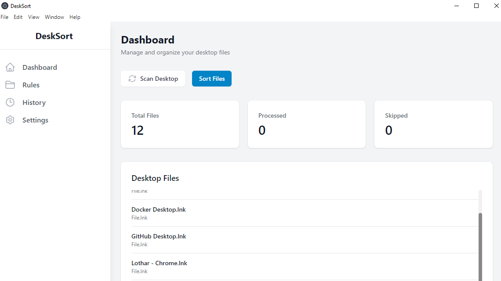

# DeskSort

A professional desktop organization tool that automatically sorts and organizes your files based on custom rules.

## 🚀 Quick Start

**Run Development Mode:**
```bash
npm install
npm run dev
```

**Build Production:**
```bash
npm run build
npm run make
```

## 📸 Screenshots


*DeskSort's main dashboard showing file organization in action*

## Features

- 🔍 Automatic desktop scanning and file organization
- 📁 Custom sorting rules based on file types
- 🎯 Intelligent file categorization
- 📊 Sorting history and logs
- ⚙️ Customizable settings
- 🖥️ Cross-platform support (Windows, macOS, Linux)

## Installation

1. Clone the repository:
```bash
git clone https://github.com/yourusername/desksort.git
cd desksort
```

2. Install dependencies:
```bash
npm install
```

3. Start the development server:
```bash
npm run dev
```

## Building for Production

To create a production build:

```bash
npm run build
npm run make
```

The packaged application will be available in the `out` directory.

## File Type Categories

DeskSort supports the following file categories by default:

- Documents: `.pdf`, `.docx`, `.txt`, `.odt`, `.rtf`
- Spreadsheets: `.xls`, `.xlsx`, `.csv`, `.ods`
- Presentations: `.pptx`, `.odp`, `.key`
- Images: `.jpg`, `.jpeg`, `.png`, `.gif`, `.bmp`, `.webp`, `.tiff`
- Videos: `.mp4`, `.mkv`, `.avi`, `.mov`, `.webm`, `.flv`
- Audio: `.mp3`, `.wav`, `.aac`, `.ogg`, `.flac`
- Archives: `.zip`, `.rar`, `.7z`, `.tar.gz`, `.tar`, `.gz`
- Code Files: `.js`, `.py`, `.rs`, `.cpp`, `.html`, `.css`, `.json`, `.ts`
- Executables: `.exe`, `.msi`, `.sh`, `.bat`, `.AppImage`

You can add custom categories and file extensions through the Rules management interface.

## Usage

1. Launch DeskSort
2. Set up sorting rules in the Rules tab
3. Click "Scan Desktop" to view current files
4. Click "Sort Files" to organize your desktop

## Development

- Built with Electron, React, and SQLite
- Uses Tailwind CSS for styling
- TypeScript for type safety
- Follows modern React best practices

## Contributing

1. Fork the repository
2. Create your feature branch (`git checkout -b feature/amazing-feature`)
3. Commit your changes (`git commit -m 'Add some amazing feature'`)
4. Push to the branch (`git push origin feature/amazing-feature`)
5. Open a Pull Request

## License

This project is licensed under the MIT License - see the LICENSE file for details. 